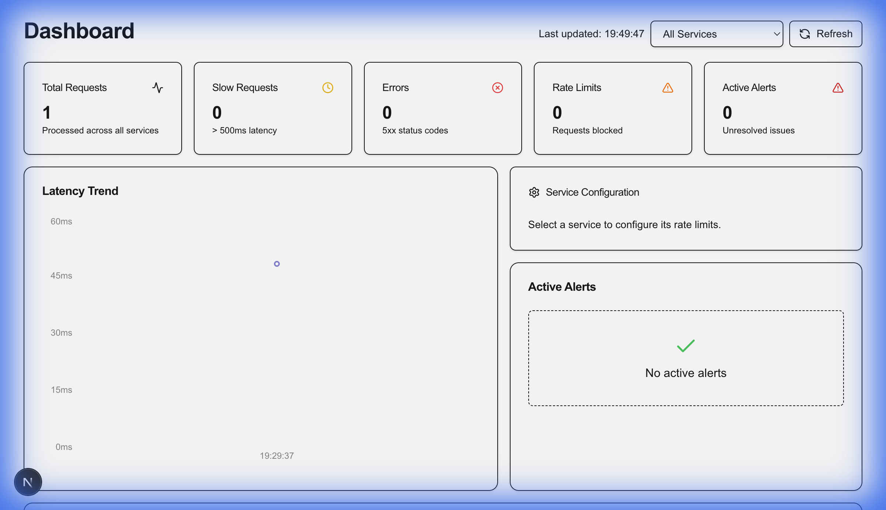

# API Observability & Monitoring Platform

A robust, full-stack platform for real-time API monitoring, alerting, and dynamic rate limiting.



## 🚀 Overview

This project provides a complete solution for tracking API usage, detecting anomalies (high latency, errors), and managing service throughput dynamically. It consists of a centralized Collector Service, a modern Web Dashboard, and a smart Tracking Client Library.

## 🏗 Architecture

The system is composed of three main components:

1.  **Collector Service (Backend)**:
    *   Ingests logs asynchronously from clients.
    *   Analyzes data for alerts (Error Rate > 4%, Latency > 500ms).
    *   Manages centralized configuration (Rate Limits).
    *   Built with **Kotlin** & **Spring Boot 3.4**.
    *   Database: **MongoDB** (Dual connection support for high availability).

2.  **Web Dashboard (Frontend)**:
    *   Real-time visualization of API statistics.
    *   Alert management interface (View & Resolve).
    *   **Dynamic Service Configuration**: Update rate limits for services on the fly.
    *   Built with **Next.js 15**, **TypeScript**, **Tailwind CSS**, and **ShadCN UI**.

3.  **Tracking Client (Library/Demo)**:
    *   Interceptor-based logging library.
    *   **Smart Rate Limiter**: Polling-based Token Bucket algorithm that adapts to limits set in the Dashboard.
    *   Built with **Kotlin** & **Spring Boot**.

## ✨ Features

*   **⚡️ Real-time Monitoring**: Track total requests, error rates, and slow APIs.
*   **🚨 Intelligent Alerting**: Automatically generates alerts for:
    *   High Error Rates
    *   High Latency (> 500ms)
    *   Rate Limit Breaches
*   **🎛 Dynamic Rate Limiting**: Change the allowed requests-per-minute for any service from the UI, and clients update automatically within 30 seconds.
*   **📊 Interactive Dashboard**: Clean, modern UI for DevOps/SRE teams.

## 🛠 Tech Stack

*   **Language**: Kotlin (JDK 25)
*   **Frameworks**: Spring Boot 3.4, Next.js 15
*   **Database**: MongoDB
*   **Build Tools**: Gradle 9.2, npm
*   **Libraries**: Bucket4j (Rate Limiting), Axios, Lucide React

## 🏁 Getting Started

### Prerequisites
*   Java 25+
*   Node.js 18+
*   MongoDB running on `localhost:27017`

### 1. Start the Collector Service
This service is the brain of the operation.
```bash
cd collector-service
./gradlew bootRun
```
*Runs on `http://localhost:8081`*

### 2. Start the Dashboard
The control center.
```bash
cd dashboard
npm install
npm run dev
```
*Runs on `http://localhost:3000`*

### 3. Start the Tracking Client (Demo)
A sample service to generate traffic and test rate limits.
```bash
cd tracking-client
./gradlew bootRun
```
*Runs on `http://localhost:8082`*

## 🧪 Verification & Usage {id="verification"}

1.  **Generate Traffic**: Use the following command to send a burst of requests to the tracking client.
    ```bash
    for i in {1..10}; do curl -I -w "Status: %{http_code}\n" http://localhost:8082/test/success; done
    ```
2.  **Test Rate Limiting**:
    *   Go to the Dashboard (`http://localhost:3000`).
    *   Find the `tracking-client-demo` configuration card.
    *   Set the limit to **5**.
    *   Wait ~30 seconds (for the client to poll the new config).
    *   Run the curl loop again. You will see `429 Too Many Requests` after the 5th request.
3.  **Resolve Alerts**:
    *   Check the "Active Alerts" section in the dashboard.
    *   Click "Resolve" on any active alert to acknowledge it.

## 📂 Project Structure

```
├── collector-service/   # Spring Boot Backend
├── dashboard/           # Next.js Frontend
├── tracking-client/     # Spring Boot Demo Client
└── docs/                # Documentation & Assets
```

---
*Created by Dheeraj U*
